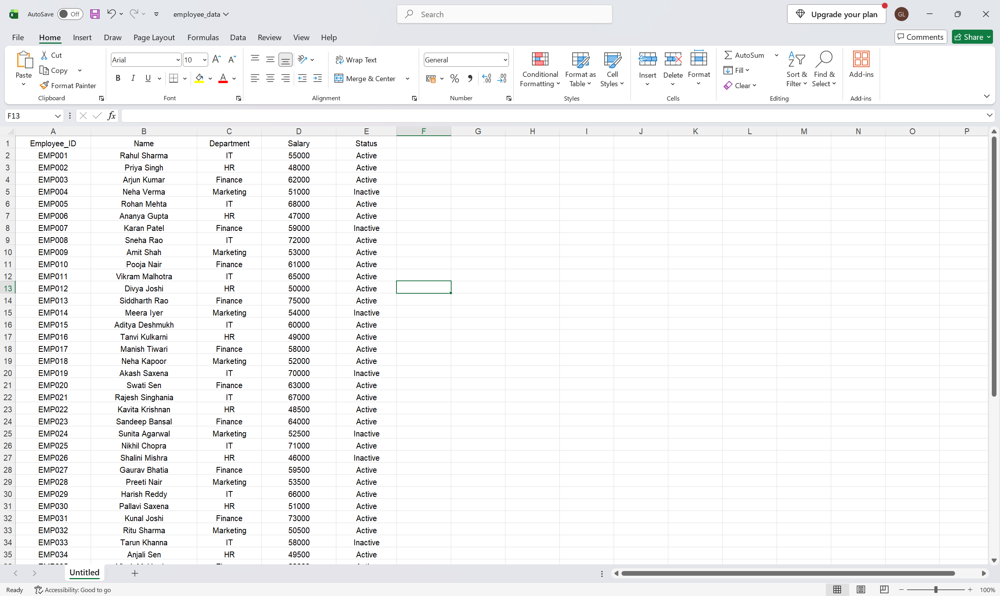

# AA-01 — Excel Data Reader & Salary Classifier

> An Automation Anywhere Automation 360 bot for reading employee records from Excel, processing salary data, applying business rules, and displaying the processed results.

---

## Overview

**AA-01 — Excel Data Reader & Salary Classifier** is a Level 1 Automation Anywhere project focused on structured Excel data processing.

The bot reads employee records from an Excel workbook, stores the extracted dataset in a Data Table, iterates through each employee record using a Record variable, converts salary values to numeric values, applies salary-based classification rules, and displays the processed result.

The implementation demonstrates the core building blocks used in larger RPA workflows: data extraction, structured variables, iteration, type conversion, conditional logic, and result presentation.

---

## Objective

The project demonstrates how Automation Anywhere can be used to:

- Read structured data from Excel.
- Store tabular data using Data Table variables.
- Iterate through individual records.
- Access fields using Record variables.
- Convert values between data types.
- Apply deterministic business rules.
- Present processed results.
- Organize an RPA project in a maintainable repository structure.

---

## Technology Stack

| Technology | Purpose |
| --- | --- |
| Automation Anywhere Automation 360 | RPA platform |
| Microsoft Excel | Input data source |
| Data Table | Stores the extracted worksheet data |
| Record Variable | Represents the employee record being processed |
| Iterator Loop | Processes records sequentially |
| Conditional Logic | Applies salary classification rules |

---

## Input

The bot reads the following workbook:

```text
input/employee_data.xlsx
```

### Input Schema

| Field | Description |
| --- | --- |
| `Employee_ID` | Unique employee identifier |
| `Name` | Employee name |
| `Department` | Employee department |
| `Salary` | Employee salary |
| `Status` | Current employment status |

The first row of the worksheet is treated as the column header.

---

## Output

The current implementation displays the processed employee record through an Automation Anywhere **Message Box** during execution.

Each processed record contains:

- Employee ID
- Name
- Department
- Salary
- Salary Classification
- Employment Status

### Salary Classification Rules

| Salary Range | Classification |
| --- | --- |
| `< 50,000` | `Low` |
| `50,000 – < 80,000` | `Medium` |
| `>= 80,000` | `High` |

### Example

```text
Employee ID: EMP001
Name: Rahul Sharma
Department: IT
Salary: 55000
Classification: Medium
Status: Active
```

> **Current implementation:** The bot does not generate a separate output Excel workbook. Results are displayed during execution.

---

## Architecture

The automation follows a sequential data-processing pipeline:

```text
┌──────────────────────────────┐
│      Employee Excel File     │
│      employee_data.xlsx      │
└──────────────┬───────────────┘
               │
               ▼
┌──────────────────────────────┐
│        Excel Session         │
│        employeeSession       │
└──────────────┬───────────────┘
               │
               ▼
┌──────────────────────────────┐
│      Get Multiple Cells      │
│          All Rows            │
└──────────────┬───────────────┘
               │
               ▼
┌──────────────────────────────┐
│          Data Table          │
│         employeeData         │
└──────────────┬───────────────┘
               │
               ▼
┌──────────────────────────────┐
│      For Each Row in Table   │
└──────────────┬───────────────┘
               │
               ▼
┌──────────────────────────────┐
│        Record Variable       │
│        currentEmployee       │
└──────────────┬───────────────┘
               │
               ├─────────────────────┐
               │                     │
               ▼                     ▼
┌────────────────────────┐  ┌────────────────────────┐
│ Extract Employee Data  │  │    Extract Salary      │
└────────────────────────┘  └───────────┬────────────┘
                                        │
                                        ▼
                             ┌────────────────────────┐
                             │    String → Number     │
                             │ employeeSalaryNumber   │
                             └───────────┬────────────┘
                                         │
                                         ▼
                             ┌────────────────────────┐
                             │ Salary Classification  │
                             │      IF / ELSE IF      │
                             │         / ELSE         │
                             └───────────┬────────────┘
                                         │
                                         ▼
                             ┌────────────────────────┐
                             │    Message Box Output  │
                             └────────────────────────┘
```

---

## Processing

### 1. Open the Excel Workbook

The bot opens the input workbook using:

```text
Excel Advanced → Open
```

The Excel session is stored in:

```text
employeeSession
```

The workbook is configured to contain a header row, allowing employee fields to be accessed by column name.

---

### 2. Read Employee Records

The bot uses:

```text
Excel Advanced → Get multiple cells
```

The configured range is:

```text
All rows
```

The extracted worksheet data is assigned to the Data Table variable:

```text
employeeData
```

`employeeData` represents the complete set of employee records loaded from the workbook.

---

### 3. Iterate Through Records

The bot uses an Iterator Loop configured as:

```text
For each row in table
```

The iterator processes:

```text
employeeData
```

During each iteration, the current row is assigned to:

```text
currentEmployee
```

`currentEmployee` is a Record variable representing one employee at a time.

---

### 4. Access Employee Fields

Individual fields are accessed from the current Record variable using their Excel column names:

```text
$rCurrentEmployee{Employee_ID}$
$rCurrentEmployee{Name}$
$rCurrentEmployee{Department}$
$rCurrentEmployee{Salary}$
$rCurrentEmployee{Status}$
```

This allows the workflow to operate on each employee record without hard-coding row positions.

---

### 5. Convert Salary

The salary value is first assigned to:

```text
employeeSalary
```

The value is then converted from a String to a Number.

The resulting numeric value is stored in:

```text
employeeSalaryNumber
```

Numeric conversion allows the salary to be evaluated using numerical comparison operators.

---

### 6. Apply Salary Classification

The numeric salary is evaluated using conditional logic:

```text
IF employeeSalaryNumber < 50000
    salaryClassification = "Low"

ELSE IF employeeSalaryNumber < 80000
    salaryClassification = "Medium"

ELSE
    salaryClassification = "High"
```

The resulting classification is stored in:

```text
salaryClassification
```

---

### 7. Display the Processed Record

The processed employee information is displayed using a Message Box.

The displayed fields are:

```text
Employee ID
Name
Department
Salary
Classification
Status
```

After displaying the result, the loop continues with the next employee record until all rows in `employeeData` have been processed.

---

## End-to-End Processing Flow

```text
Read Excel Workbook
        │
        ▼
Create Excel Session
        │
        ▼
Read All Employee Records
        │
        ▼
Store Records in Data Table
        │
        ▼
Iterate Through Each Record
        │
        ▼
Extract Employee Fields
        │
        ▼
Extract Salary
        │
        ▼
Convert Salary to Number
        │
        ▼
Apply Salary Classification
        │
        ▼
Display Processed Record
        │
        ▼
Process Next Record
        │
        ▼
Repeat Until All Records Are Processed
```

---

## Repository Structure

```text
excel-data-reader/
│
├── README.md
│
├── bot/
│   └── <exported-bot>.json
│
├── input/
│   └── employee_data.xlsx
│
├── output/
│   └── README.md
│
└── screenshots/
    ├── Dataset.png
    └── Bot Workflow.png
```

The `bot/` directory contains the exported Automation Anywhere bot JSON.

The `input/` directory contains the dataset required by the automation.

The `output/` directory documents the current output behavior and can contain generated artifacts in future versions.

The `screenshots/` directory contains visual evidence of the dataset, workflow configuration, and execution.

---

## Automation Anywhere Concepts Demonstrated

This project demonstrates:

- Excel session management
- Excel data extraction
- Data Table variables
- Record variables
- Iterator-based loops
- Column-based record access
- String-to-number conversion
- Variable assignment
- Conditional branching
- Message Box output
- Bot execution and validation

---

## Validation

The bot was executed successfully against the employee dataset.

The validated workflow is:

```text
Excel Input
    ↓
Data Extraction
    ↓
Record Iteration
    ↓
Salary Conversion
    ↓
Salary Classification
    ↓
Processed Record Display
```

---

## Screenshots

### Dataset



### Bot Workflow


---

## Limitations

The current implementation intentionally focuses on the core Excel-reading and record-processing workflow.

Current limitations:

- No generated output Excel report.
- No automated email delivery.
- No external database integration.
- No advanced exception-handling workflow.
- Salary thresholds are currently hard-coded.
- No aggregated salary statistics.

These limitations define the scope of Version 1 and provide clear extension points for future iterations.

---

## Future Enhancements

### Output Report

Generate a processed Excel workbook containing the original employee data and the calculated classification.

### Data Validation

Add validation for:

- Missing employee IDs
- Empty employee names
- Invalid departments
- Missing salary values
- Non-numeric salary values

### Analytics

Generate:

- Average salary
- Department-wise salary statistics
- Employee counts by classification
- Active versus inactive employee summaries

### Reporting

Generate and distribute an automated employee salary report through email.

### Configuration

Move salary classification thresholds into a configuration file so business rules can be modified without changing the bot workflow.

---

## Project Status

| Attribute | Value |
| --- | --- |
| Status | Completed — Version 1 |
| Project Level | Level 1 — Beginner |
| Platform | Automation Anywhere Automation 360 |
| Domain | Robotic Process Automation |
| Input | Excel workbook |
| Output | Message Box |

---

## Author

Developed as part of an Automation Anywhere RPA portfolio, demonstrating practical experience with Excel automation, structured data processing, workflow design, and business-rule implementation.
